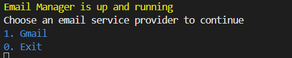

# Email Manager

An email manager which can be used to fetch email from different email service providers and act on them based on the provided rules


## Run application

Clone the project

```bash
  git clone https://github.com/Phil-Hary/email-manager.git
```

Go to the project directory

```bash
  cd email-manager
```

Install dependencies

```bash
  # create env
  python3 -m venv env

  # activate env
  # windows
  env\Scripts\activate

  # mac
  source myenv/bin/activate

  #install dependencies
  pip install -r requirement.txt
  
```

Run migrations

This will setup the sqlite database and the tables for you

```bash
  # run migrations
  alembic -c db/alembic.ini upgrade head
```

Secrets for OAuth

Inorder to enable Gmail OAuth, you need to generate the client secrets and it to the application. To set it up follow this [Google Oauth - Python quickstart guide](https://developers.google.com/gmail/api/quickstart/python)

Once you have generated the secrets.json, add it to the application using the following commands

```bash
  touch client_secrets.json
  # now copy content from the downloaded secrets to this client_secret.json
```

Start the application

```bash
  py email_manager.py
```

If everything is configured properly, you will see the following in your terminal



## Edit rules

To edit the rules, run the following command

```bash
  #make sure you are in the email manager directory
  cd email-manager
  
  #open rules.json and update the rules
  vi rules.json
```

## Running Tests

To run tests, run the following command

```bash
  #make sure you are in the email manager directory
  cd email-manager
  
  #run tests
  pytest tests/
```

